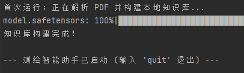
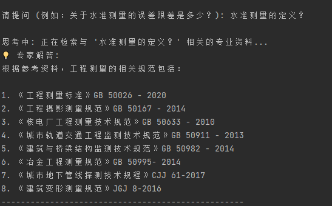
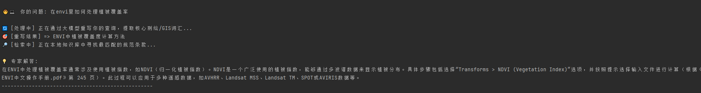

# GIS_RAG
# 基于 LLM 应用开发框架构建检索增强生成（RAG）系统，解决大模型在特定垂直领域（如测绘专业知识）的幻觉问题

## 技术栈：
LangChain，PyMuPDF + RecursiveCharacterTextSplitter，BAAI/bge-large-zh-v1.5，ChromaDB，Qwen API

## 第一步：搭建项目结构与环境
首先创建文件夹GIS_RAG，然后在根目录创建data文件夹存储数据集，并在根目录创建运行代码

之后打开终端配置环境，执行下面的命令

```bash
pip install langchain langchain-community langchain-openai langchain-huggingface chromadb pymupdf sentence-transformers
```

## 第二步：
收集专业数据，pdf版文档，例如测绘工程等专业规范

## 第三步：
编辑核心代码，已经附带了rag_app.py文件里面。

## 第四步
运行即可
```bash
python rag_app.py
```



## 操作遇到的问题:
在配置环境时出现了缺少微软的 C++ 编译器，一直显示报错，解决办法是#安装了Download Build Tools。

# 更新优化版
## 解决查询意图偏移： 
大模型虽然给出了答案，但用户不知道它是从哪本规范里找出来的，不敢直接用于工程决策。
针对用户口语化提问导致向量检索召回率低的问题，引入 Query Rewriting (查询重写) 机制，通过 LLM 在检索前进行专业词汇扩展与意图对齐，显著提升了长尾/口语化问题的检索准确率。
“优化 Prompt Engineering 与元数据传递链路，实现大模型输出结果的精准溯源，支持显示参考的规范名称及具体页码，大幅提升了系统在严肃工程领域的可信度。”

```python
def rewrite_query(original_query):
    """
    [优化4：查询重写] 将用户的口语化提问，转化为专业且富含关键词的检索语句
    """
    print("\n🔄 [处理中] 正在通过大模型重写你的查询，提取核心测绘/GIS词汇...")
    
    rewrite_template = """你是一个测绘与GIS领域的检索专家。
    请将用户的原始提问改写为更适合在专业规范文档中进行向量检索的查询语句。
    要求：
    1. 提取核心专业词汇，补充可能的全称或学名（例如把 RTK 补充为 实时动态差分法）。
    2. 剥离口语化的无用词汇（如“我想知道”、“告诉我”）。
    3. 必须只输出改写后的查询语句，不要输出任何解释。
    
    原始提问：{query}
    改写后的检索词："""
    
    prompt = PromptTemplate.from_template(rewrite_template)
    # StrOutputParser 可以直接把大模型的复杂输出剥离成纯文本字符串
    chain = prompt | llm | StrOutputParser()
    
    rewritten_query = chain.invoke({"query": original_query})
    print(f"🎯 [重写结果] => {rewritten_query.strip()}")
    return rewritten_query.strip()
```

## 解决模型幻觉与可信度： 
由于用户提问可能指代不明（比如连续提问时说：“那它的误差是多少？”），直接去数据库搜根本搜不到,因此我们在去向量数据库（ChromaDB）检索之前，先拦截用户的提问，让大模型（Qwen）做一次“翻译”。比如用户问“RTK精度多高”，大模型会将其重写为“RTK 实时动态差分定位 测量精度 误差限差”，用这个包含丰富专业词汇的新句子去检索，召回率会大幅提升。深度定制文档加载与切分链路，全程保留文档级 Metadata（文件名及页码）。通过 Prompt Engineering 强制大模型输出带有精确溯源的解答（如：“依据《XX规范》第X页”），实现了系统在严谨测绘工程场景下的高可信度落地。

```python
def chat_with_data(original_query, vectorstore):
    """
    带溯源能力的问答主函数
    """
    # 第一步：调用查询重写 (Opt 4)
    better_query = rewrite_query(original_query)
    
    print("🔎 [检索中] 正在本地知识库中寻找最匹配的规范条款...")
    
    # 第二步：使用重写后的更好词汇去检索 Top-3 文本块
    retriever = vectorstore.as_retriever(search_kwargs={"k": 3})
    retrieved_docs = retriever.invoke(better_query)
    
    # 第三步：组装带有 Metadata (来源页码) 的上下文 (Opt 2)
    context_parts = []
    for i, doc in enumerate(retrieved_docs):
        # 提取文件名（去掉路径，只留文件名）
        source_file = os.path.basename(doc.metadata.get('source', '未知文档'))
        # 提取页码 (LangChain 默认页码从 0 开始，所以为了人类阅读习惯加 1)
        page_num = doc.metadata.get('page', 0) + 1 
        
        # 将来源信息和文本块拼接在一起
        chunk_info = f"【来源 {i+1}: 《{source_file}》 第 {page_num} 页】\n内容: {doc.page_content}"
        context_parts.append(chunk_info)
        
    context = "\n\n".join(context_parts)
    
    # 第四步：带有严格格式要求的 Prompt (Opt 2)
    template = """你是一个严谨的测绘工程与GIS专家。请严格基于以下【参考资料】回答【用户问题】。
    
    【回答要求】：
    1. 如果参考资料中没有相关信息，请直接回答“当前知识库中暂无相关规定”，绝不要凭空捏造。
    2. 你的回答必须明确标出引用来源。格式要求：在陈述完一个观点后，在括号内注明出处，如：“...要求误差控制在 5mm 以内（根据《工程测量规范.pdf》第 X 页）。”
    
    【参考资料】：
    {context}
    
    【用户问题】：{query}
    
    【你的专业解答】："""
    
    prompt = PromptTemplate.from_template(template)
    chain = prompt | llm | StrOutputParser()
    
    # 注意：最终回答时，依然传入用户原始的口语化提问，这样回答显得更自然
    response = chain.invoke({"context": context, "query": original_query})
    return response
```


# 遇到的问题：
cpu加载处理缓慢，更换到CUDA
